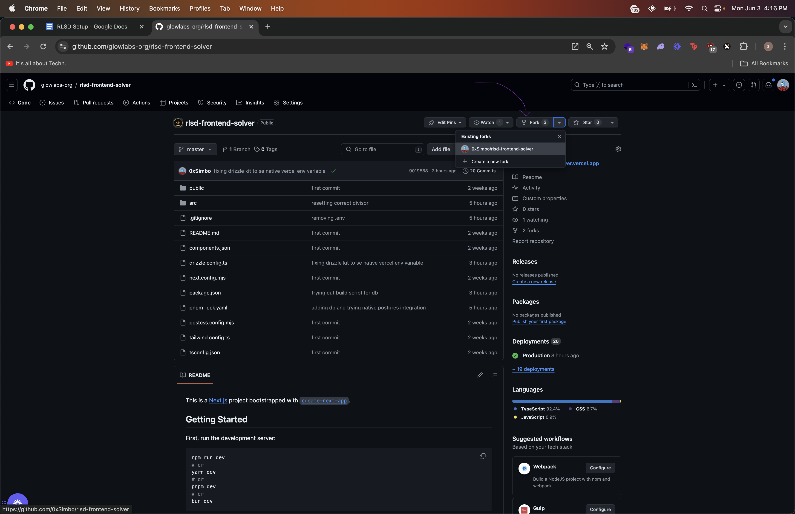
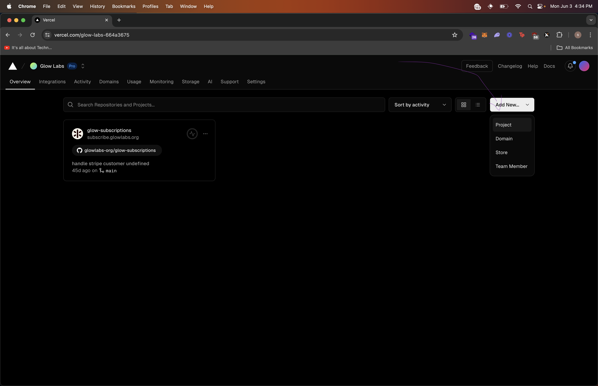
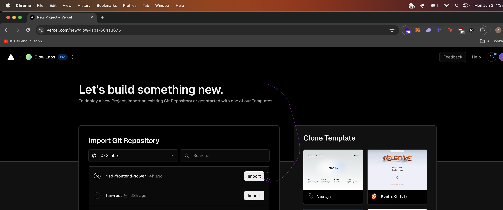
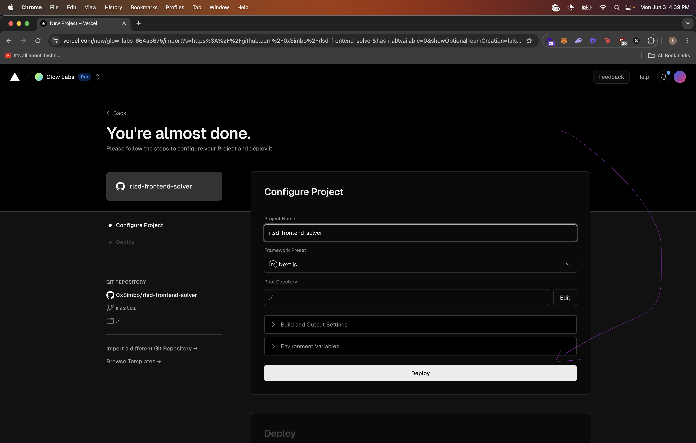
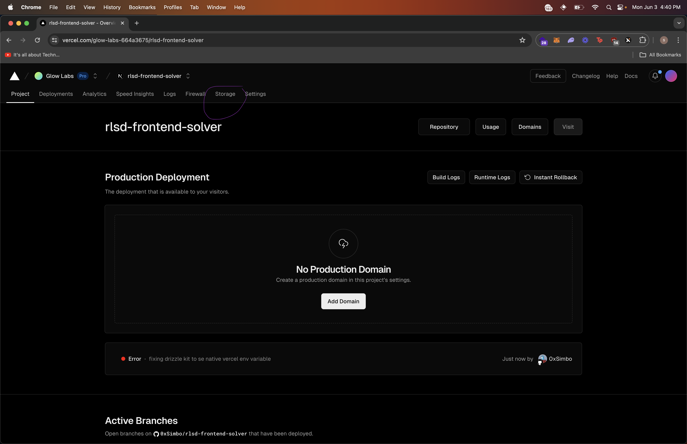
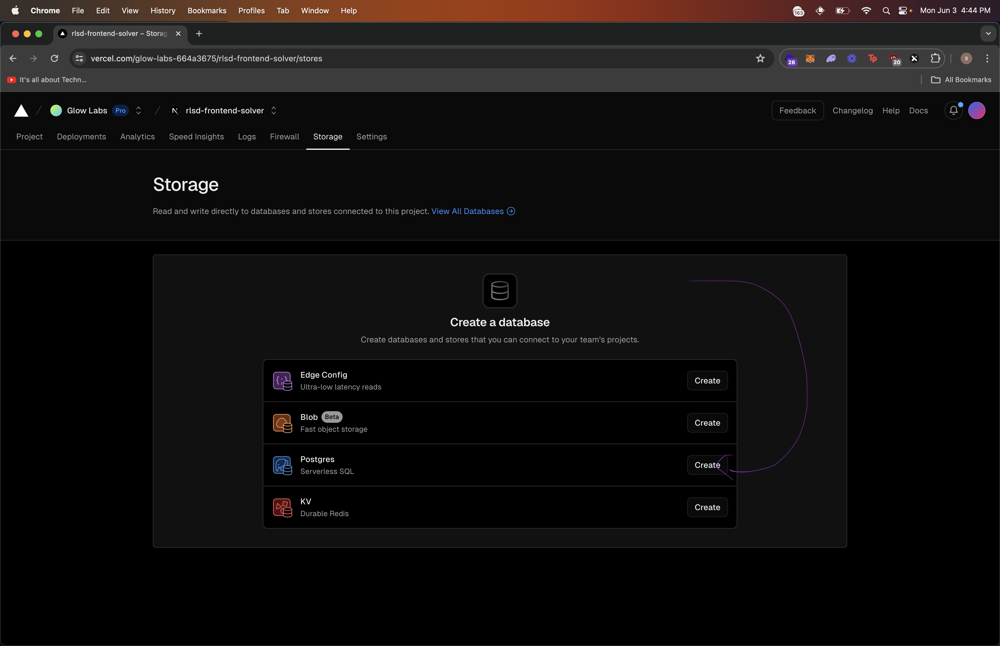
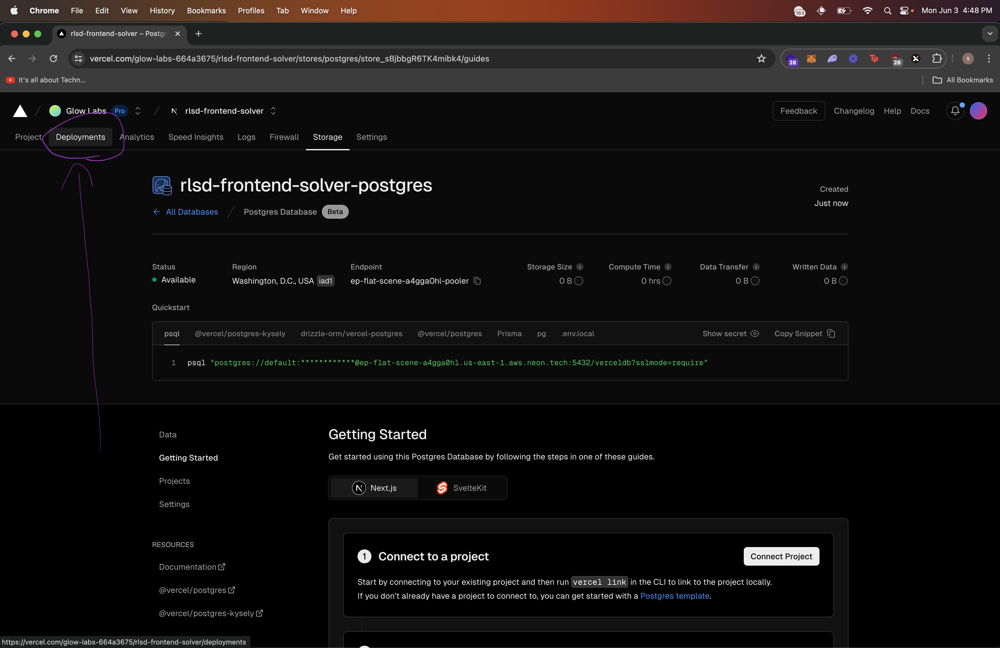
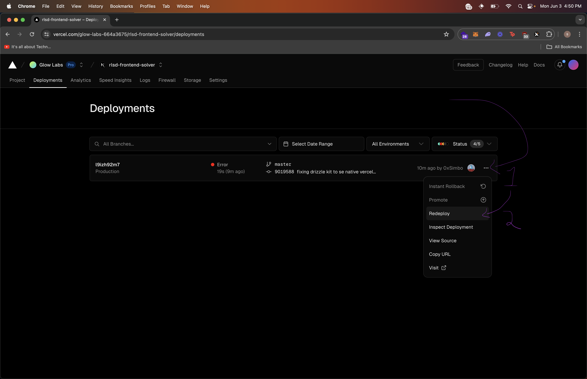
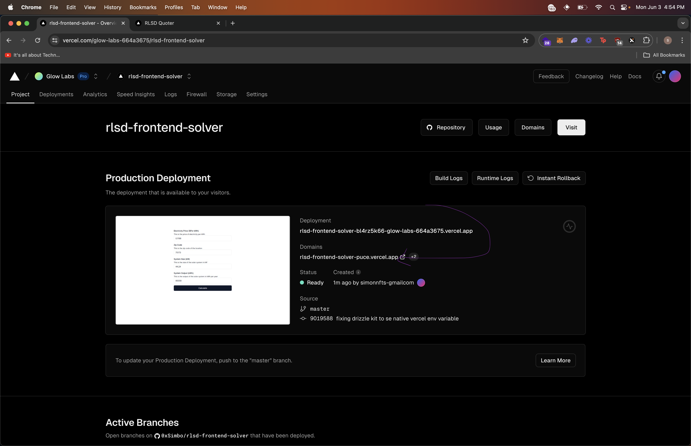

# Hosting Guide

1. Fork this repository to your GitHub account
   
2. Create A Vercel Account [here](https://vercel.com/signup)
3. Choose the lowest tier plan that is not free (this is required in order to setup the data storage)
4. Connect your GitHub account to Vercel
5. Create a new project on the vercel dashboard
   
6. Import Repository and Launch Project
   
   
7. Go back to your dashboard and click on the project you just created
8. Go to the `storage` tab
   - Note: The first deploy should have failed because we haven't setup storage yet
     
9. Add Postgres
   - Click yes on all subsequent messages
     
10. Go into `deployments`
    
11. Hit `redeploy` on the latest deployment to register the new storage
    
12. Wait for the build to finish, go back to dashboard, and find your deployment URL
    
